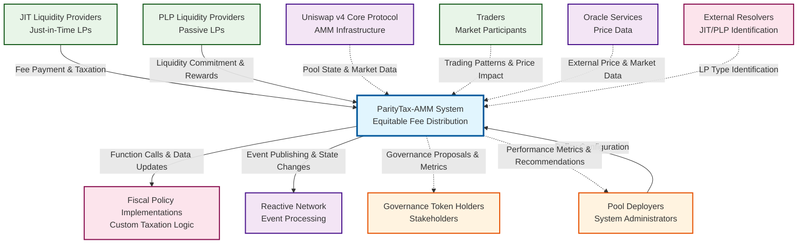

# ParityTax-AMM Context Diagram

## Legend

- **Bold Arrows**: Causal communication (direct actions affecting the system)
- **Dashed Arrows**: Informational communication (data exchange for decision making)
- **System Under Development**: ParityTax-AMM System (center)
- **External Entities**: All other components that interact with the system

## Communication Types

### Causal Communication
- JIT LPs → SuD: Fee payment and taxation
- PLPs → SuD: Liquidity commitment and reward claims
- Pool Deployers → SuD: Policy parameter configuration
- SuD → Fiscal Policy: Function calls and data updates
- SuD → Reactive Network: Event publishing and state changes

### Informational Communication
- Uniswap v4 → SuD: Pool state and market data
- Traders → SuD: Trading patterns and price impact data
- Oracle Services → SuD: External price and market data
- External Resolvers → SuD: LP type identification data
- SuD → Governance: Governance proposals and metrics
- SuD → Pool Deployers: Performance metrics and recommendations
